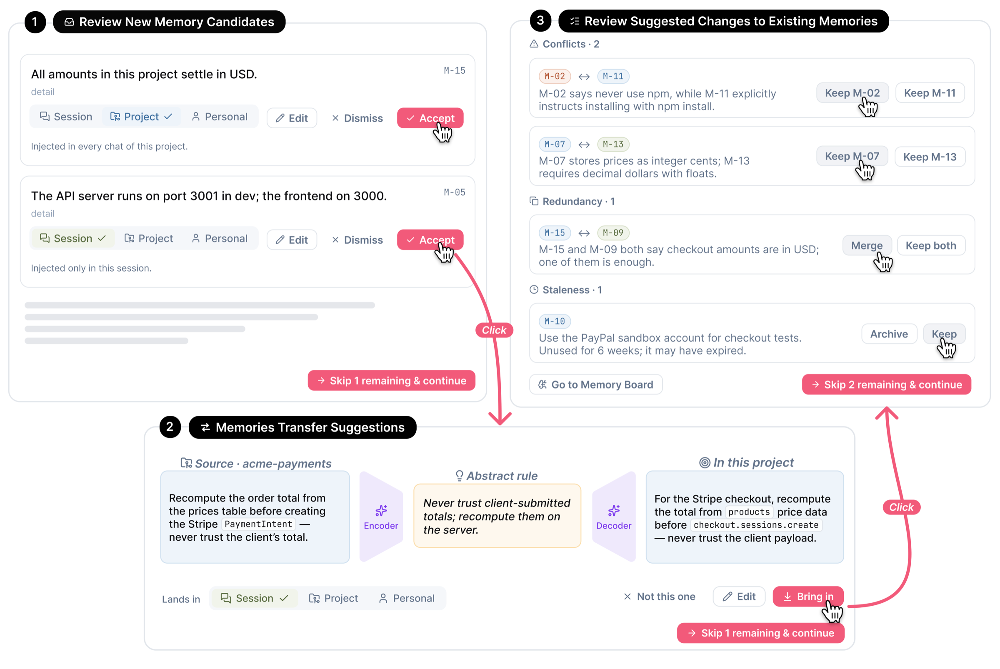
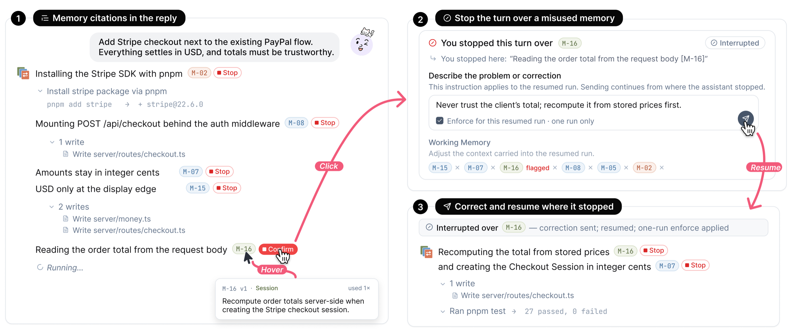
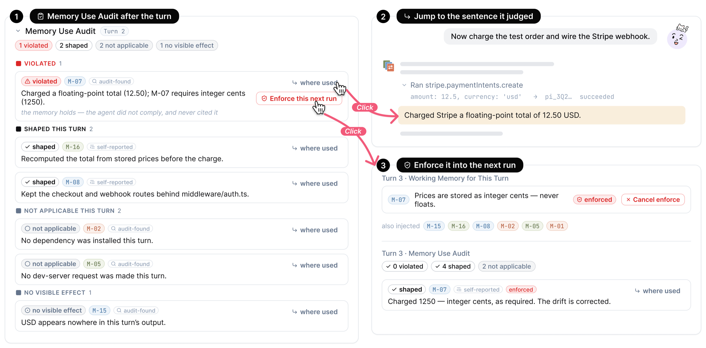
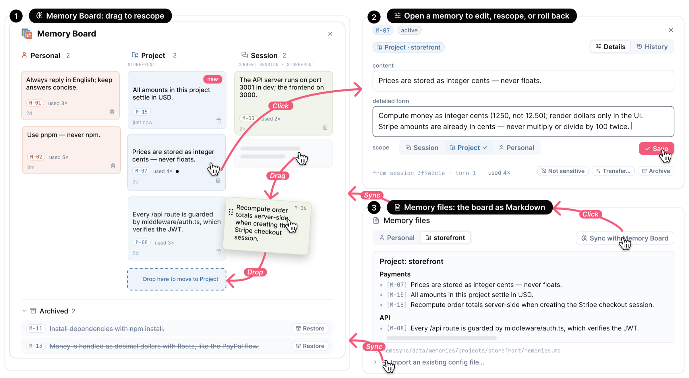

<p align="center">
  
</p>

<h1 align="center">MemoSync</h1>

<p align="center">Anonymous review artifact</p>

<p align="center">
  <strong>Co-manage your coding agent's memory: see what it remembers, decide what it keeps, choose what it uses, and audit how it used it.</strong>
</p>

<p align="center">
  <a href="LICENSE"></a>
  
  
  
  
</p>

<br />

<p align="center">
  
</p>

<p align="center">
  <sub>MemoSync in the middle of a turn. <b>(A)</b> the pre-turn review of long-term memory, <b>(B)</b> the Memory Board, <b>(C)</b> the working memory confirmed for this turn, <b>(D)</b> inline memory citations with a Stop control, <b>(E)</b> the post-turn Memory Use Audit, <b>(F)</b> the per-turn Memory Record.</sub>
</p>

<br />

## Why MemoSync

Coding agents accumulate memory — `CLAUDE.md` files, auto-extracted notes, session summaries — but the developer rarely knows what is in it, what the agent brought into a turn, or whether the agent followed it. Memory changes behind your back, stale rules from an old project leak into a new one, and a violated constraint only shows up when the tests fail.

MemoSync is a local web workbench for coding agents that treats agent memory as a **shared, operable representation**: a store of versioned memory items that you and the agent both read, propose changes to, and act on. At every stage of a turn the system shows what changed and proposes an action; you review and decide. Nothing is written to memory, injected into a turn, or enforced on the agent without your say-so.

<p align="center">
  
</p>

<p align="center">
  <sub>The design borrows the <em>metamemory</em> loop from cognitive psychology: meta-level judgements <b>monitor</b> object-level memory processes and <b>control</b> them. With a coding agent, that loop is split across the human–agent boundary — the agent runs the memory processes, but the developer needs to keep the monitoring and control. MemoSync closes the loop at five points: how memory is represented, how it evolves, what is selected for a turn, how it is applied during execution, and what effect it had.</sub>
</p>

Each memory item is a one-line summary with a scope (**personal**, **project**, or **session**) plus metadata that accumulates over time: a detailed form the agent loads on demand, a version number, a status, a usage count, and a history log. The same item takes a different form at each stage of a turn — a proposal card, a working-memory row, an inline citation, an audit verdict — and two persistent views, the Memory Board and the Memory Record, carry it between turns.

## Contents

- [How a turn works](#how-a-turn-works)
  - [1 · Evolution — review changes to long-term memory](#1--evolution--review-changes-to-long-term-memory)
  - [2 · Selection — compose the working memory](#2--selection--compose-the-working-memory)
  - [3 · Execution — trace and interrupt memory use](#3--execution--trace-and-interrupt-memory-use)
  - [4 · Impact — audit memory use and enforce a rule](#4--impact--audit-memory-use-and-enforce-a-rule)
  - [Between turns — Memory Board and Memory Record](#between-turns--memory-board-and-memory-record)
- [Features at a glance](#features-at-a-glance)
- [Quickstart](#quickstart)
- [Configuration](#configuration)
- [Command line](#command-line)
- [How it is built](#how-it-is-built)
- [Development](#development)
- [Data, privacy, and usage logging](#data-privacy-and-usage-logging)
- [License](#license)

## How a turn works

The walkthrough below follows a developer adding Stripe checkout to a small shop whose store already holds personal habits (`M-02` "Use pnpm, never npm"), project facts (`M-07` "Prices are stored as integer cents, never floats"), and lessons from an earlier payments project.

### 1 · Evolution — review changes to long-term memory

<p align="center">
  
</p>

Before a turn starts, MemoSync presents three review steps for proposed changes to long-term memory. Each change needs explicit approval before it is written to the store.

1. **Review New Memory Candidates** — items extracted from the last exchange (including the real work trajectory: files touched, commands run, errors hit), each with a proposed scope. Accept, edit, rescope, or dismiss.
2. **Memory Transfer Suggestions** — rules from *other* projects that may apply here. Copying a rule verbatim drags in source-project details, so transfer is two-staged: an **encoder** abstracts the source rule into a project-independent form, a **decoder** rewrites it against this project's memory and the current task. Source, abstract rule, and rewritten rule sit side by side so every transformation is reviewable.
3. **Review Suggested Changes to Existing Memories** — conflicts between new and old items, redundant pairs to merge, and items that have gone stale, each with a one-line reason. Repeatedly violated items surface here with a revision proposal.

### 2 · Selection — compose the working memory

<p align="center">
  
</p>

**Working Memory for This Turn** opens before the agent starts. Each proposed row shows the item, its scope, and a line stating *how the agent is expected to use it* ("Compute the checkout total from stored prices, not the client payload"). Remove a row, add items from the memory pool, or adjust the selection in plain language — "Anything about the API server setup? Drop the commit-style ones" — and the in-card assistant answers with live `M-NN` chips. What you confirm is exactly what the agent is charged against later.

### 3 · Execution — trace and interrupt memory use

<p align="center">
  
</p>

As the reply streams, the agent is instructed to cite each memory it applies. Hover a citation for the item's content, scope, version, and usage count. Every citation includes a **Stop** control: press it when the agent does the opposite of what the item says, and execution is interrupted. A recovery card quotes the sentence and asks what should have happened; write the correction, optionally tick **Enforce for this resumed run**, and the agent continues in the same main session. Use the item's Save control to retain corrected memory content.

### 4 · Impact — audit memory use and enforce a rule

<p align="center">
  
</p>

When a turn ends, the **Memory Use Audit** reports one of four verdicts for each injected item: **violated**, **shaped** the turn, **not applicable**, or **no visible effect**. To avoid relying on the agent's self-report, a separate judgment of the full exchange runs after the turn, so an item violated without being cited is still caught — verdicts are tagged **audit-found** or **self-reported**. A violated row offers **Where used** (scroll to the judged sentence and the tool call behind it) and **Enforce this next run** (the item becomes a mandatory row in the next turn's working memory that only you can remove). Verdicts are written into each item's history.

### Between turns — Memory Board and Memory Record

<p align="center">
  
</p>

The **Memory Board** shows every item as one column per scope. Drag an item between columns to rescope it (dropping into another project runs the same encoder/decoder preview as a transfer); open an item to edit its content and detailed form, change its scope, transfer or archive it, and read its full history; archived items can be restored. The **Memory files** card keeps a Markdown copy of the board in sync, so the accumulated memory stays usable with `CLAUDE.md`-style files and other agents, and can import an existing configuration file as candidates for review.

The **Memory Record** in the sidebar lists, for each turn of a session, what was proposed, selected, cited, interrupted, and audited. It persists independently of the agent's context window, so after the conversation is compacted both you and the agent can still refer to it.

## Features at a glance

- **Versioned memory items** — one line each, optional detail loaded on demand, scoped to personal / project / session, with status, usage count, and full history with revert.
- **Mixed-initiative review at every stage** — the system proposes, you decide: candidates, transfers, conflicts/redundancy/staleness, per-turn selection, audit follow-ups.
- **Cross-project transfer** with an encoder/decoder pair that abstracts and re-localizes rules instead of copying them.
- **Inline citations with per-citation Stop**, correction-and-resume, and one-run enforcement.
- **Independent post-turn audit** with four verdicts and source tags (audit-found / self-reported).
- **Memory Board + Memory files** — drag-to-rescope, search, archive/restore, Markdown projection that syncs both ways, import of existing config files.
- **Memory Record** — a per-turn ledger that survives context compaction.
- **Stable session injection** — confirmed memory rides the session as a snapshot plus per-turn deltas, so memory edits can take effect without restarting the conversation.
- **Claude Code and Codex engines** — official CLI subscriptions or isolated GLM testing; memory reasoning forks from the chosen engine's conversation. Claude Code also offers DeepSeek and per-chat vendor selection.
- **A full coding workbench underneath** — project-first sidebar, plan mode, rich transcript rendering, embedded terminal, file and git panels, session resumption, local-first persistence.

## Quickstart

Requirements: [Bun](https://bun.sh) 1.3.5 or newer and a configured provider. MemoSync bundles the Claude Agent SDK runtime; the Codex engine also requires a current `codex` CLI on `PATH`. You can use your official CLI subscriptions, or test both engines with GLM in a separate profile.

Use the anonymous repository URL supplied with the submission. After copying `.env.example`, set `GLM_API_KEY` in the local `.env` before starting an isolated test.

```bash
git clone <ANONYMOUS_REPOSITORY_URL> MemoSync
cd MemoSync
bun install
cp .env.example .env
bun run build
bun run start
```

MemoSync opens at [`localhost:3210`](http://localhost:3210). For GLM, choose **Claude Code → GLM**, or **Codex** (the isolated configuration supplies its GLM model). Add a project folder and send a message to prepare the first memory review.

If Bun is not installed:

```bash
curl -fsSL https://bun.sh/install | bash
```

A step-by-step installation guide in Chinese is in [docs/DEPLOY.zh-CN.md](docs/DEPLOY.zh-CN.md).

## Configuration

All configuration is read from `.env` in the project directory (see [`.env.example`](.env.example)).

| Variable | Default | Purpose |
| --- | --- | --- |
| `DEEPSEEK_API_KEY` | — | Optional DeepSeek credential for the Claude Code engine. |
| `DEEPSEEK_MODEL` | `deepseek-v4-flash` | Default chat model; each chat can switch to `deepseek-v4-flash-vision-exp` or `deepseek-v4-pro` in the picker. |
| `DEEPSEEK_BASE_URL` | `https://api.deepseek.com` | Override for proxies or compatible endpoints. |
| `PORT` | `3210` | HTTP port. |
| `GLM_API_KEY` | — | GLM credential for Claude Code and isolated Codex sessions; their memory branches inherit the same provider. |
| `GLM_MODEL` | `glm-5.3-flash` | GLM model for isolated helper calls and the default isolated Codex configuration. |
| `GLM_BASE_URL` | `https://open.bigmodel.cn/api/anthropic` | GLM endpoint (`https://api.z.ai/api/anthropic` for the international service). |
| `GLM_CODEX_BASE_URL` | `https://open.bigmodel.cn/api/v1` | GLM's Codex Responses endpoint; separate from its Chat Completions endpoint. |
| `MEMOSYNC_ISOLATE_CLI` | unset | Set to `1` to isolate both CLI profiles and require explicit API credentials. The example configuration enables this. |
| `MEMOSYNC_CLI_PROFILE_DIR` | MemoSync data root `/cli-profiles` | Optional absolute profile root; also enables isolation. Main sessions and forks share their engine's subdirectory. |
| `MEMOSYNC_CODEX_PROVIDER` | `glm` when `GLM_API_KEY` is set | Isolated Codex provider: `glm` or `custom`. |
| `MEMOSYNC_CODEX_MODEL` | GLM model above | Explicit model for isolated Codex. Legacy `CODEX_MODEL` is also accepted. |
| `MEMOSYNC_CODEX_API_KEY`, `MEMOSYNC_CODEX_BASE_URL` | — | Explicit key and Responses endpoint for isolated `custom` Codex; also set `MEMOSYNC_CODEX_MODEL`. |
| `CLAUDE_CODE_AUTO_COMPACT_WINDOW` | `786432` | Token count at which the engine auto-compacts the conversation. MemoSync selects the 1M context window on every DeepSeek session; a "Context compacted" marker appears in the transcript when compaction happens. |
| `MEMOSYNC_USE_OWN_ANTHROPIC` | — | Set to `1` to run the chat engine on your own exported `ANTHROPIC_*` variables (a real Anthropic key or another Anthropic-compatible endpoint) instead of the derived DeepSeek bundle. |

With `DEEPSEEK_API_KEY` set, MemoSync derives the whole `ANTHROPIC_*` bundle itself and ignores leftover `ANTHROPIC_*` / `CLAUDE_CODE_*` exports from other Claude Code setups in your shell, so a stray `ANTHROPIC_BASE_URL` cannot hijack the engine.

The composer exposes an engine picker and, for Claude Code, a vendor picker (DeepSeek, GLM, Anthropic). For official Claude subscriptions choose an Anthropic model; the `sonnet` and `opus` aliases resolve in the installed Claude runtime. Leave `MEMOSYNC_ISOLATE_CLI` and `MEMOSYNC_CLI_PROFILE_DIR` unset when using existing official subscriptions. Study deployments retain their single configured Claude model.

Isolated mode gives child processes separate `CLAUDE_CONFIG_DIR` and `CODEX_HOME` directories without changing the server's `HOME`, shell settings, `~/.claude`, or `~/.codex`. It strips inherited OAuth and provider routing variables. Codex receives a provider definition through process arguments and a key through an environment variable, with an ephemeral credential store; no credential is written to a Codex config or auth file. Missing explicit credentials fail rather than use your normal login. Claude memory branches and title helpers use the same isolation rules.

For a live check of both engines, export `GLM_API_KEY` in the current shell and run:

```bash
bun run scripts/smoke-isolated-branches.ts
```

The check creates a temporary workspace and profile, exercises three parallel forks, review continuation, working-memory selection, main-context isolation, and post-turn audit, then removes its temporary files. Add `claude` or `codex` to test one engine. Provider calls use the configured GLM account.

`bun run scripts/smoke-memosync-pipeline.ts claude` exercises the complete application coordinator with the real memory prompts and parsers across two turns, automatically reviewing the test proposals. Use `codex` for the other engine. Both checks isolate all CLI state in a temporary profile; the full pipeline check has a ten-minute limit.

The GLM endpoints and Claude `[1m]` selector follow the [GLM model guide](https://docs.bigmodel.cn/cn/coding-plan/latest-model). CLI profile behavior is documented in the [Claude environment reference](https://code.claude.com/docs/en/env-vars) and [Codex configuration reference](https://learn.chatgpt.com/docs/config-file/config-reference).

## Command line

```bash
bun run start
bun run start --port 4000
bun run start --no-open
bun run start --remote
bun run start --password <s>
bun run start --share
bun run export-data [--full]
```

## How it is built

- **Stack.** React 19 + TypeScript on the client, Bun on the server. Memory items and their histories live in SQLite; projects, chats, and transcripts are append-only JSONL logs with snapshot compaction.
- **Agent runtime.** Claude Code runs through the [Claude Agent SDK](https://github.com/anthropics/claude-agent-sdk-typescript) `query()` interface with an asynchronous prompt queue. Codex runs through the [Codex app-server](https://developers.openai.com/codex/app-server/) protocol with native thread creation, resume, fork, dynamic tools, and per-turn developer instructions. Both support official authentication or the isolated provider profile described above.
- **Memory tools.** The agent sees the memory store through an MCP server: `load_memory_detail` fetches an item's detailed form on demand and `propose_memory` lets the agent nominate a candidate mid-turn (it still goes through your review).
- **Parallel memory branches.** Candidate extraction (C), transfer (T), and memory changes (M) start together. Candidate decisions continue T and M in their existing conversations; transfer decisions continue M. A further branch selects working memory and writes expected uses after approved changes reach the store. An audit branch judges the completed turn, including uncited tool evidence. MemoSync has no direct-API fallback: every memory model call uses the chosen CLI runtime. Before the first main turn is persisted, branches explicitly start with empty history because Claude cannot fork an unpersisted session. [Implementation and validation details](docs/MEMORY_BRANCHES.md).
- **Confirmed memory injection.** Only confirmed items enter the main Memory Block and detail-tool allowlist. Claude keeps its session and updates selections through deltas; Codex receives the selected block and expected uses through per-turn developer instructions. Branch analysis transcripts stay out of the main conversation. Provider cache reuse depends on the runtime and provider; no latency saving is assumed.
- **Local-first.** Everything is stored under `~/.memosync/data/`; there is no server component beyond the local Bun process.

```
src/
├── client/                React UI
│   ├── app/               Router, pages (chat, Memory Board, settings), central state
│   ├── components/        Transcript messages, memory cards and gates, chat chrome
│   └── stores/            Zustand stores
├── server/                Bun backend
│   ├── agent.ts           Turn coordination: review gates, injection, interrupt/resume, post-turn passes
│   ├── deepseek-engine-env.ts   Derives the engine's ANTHROPIC_* bundle from DEEPSEEK_API_KEY
│   ├── chat-providers.ts  Per-chat vendor routing (DeepSeek / GLM)
│   ├── memory/            The memory engine
│   │   ├── MemoryStore.ts     Versioned items, events, relations (SQLite)
│   │   ├── capture.ts         Candidate extraction and routing
│   │   ├── checkup.ts         Conflict / redundancy / staleness / promotion checks
│   │   ├── relevance.ts       Per-turn suggestion and expected-use planning
│   │   ├── trace.ts           Post-turn memory-use audit
│   │   ├── transfer.ts        Cross-project transfer (encoder / decoder)
│   │   ├── injection.ts       Snapshot + delta injection planning
│   │   ├── fork-query.ts      Out-of-band questions on a fork of the session
│   │   └── tools.ts           MCP tools exposed to the agent
│   ├── event-store.ts     JSONL persistence, replay, and compaction
│   └── ws-router.ts       WebSocket routing and subscriptions
└── shared/                Types, protocol, tool hydration
```

## Development

```bash
bun run dev
bun test src/
bun run check
```

End-to-end scripts under `scripts/` (`e2e-claude-memory.ts`, `e2e-full-app.ts`, `e2e-memory-matrix.ts`, `ui-flows-check.ts`) drive a live instance with real model calls and are not part of `bun test`.

## Data, privacy, and usage logging

Everything MemoSync produces stays on your machine under `~/.memosync/data/`: the memory store (`memory.sqlite`), its Markdown projection (`memories/`), the chat and project logs, and a local usage log (`experiments/events.jsonl`) that records how the memory features are used — reviews, injections, citations, interrupts, audits, panel visibility — stamped with a random per-install id. **Nothing is uploaded automatically.**

```bash
bun run export-data
bun run export-data --full
```

The default bundle deliberately excludes chat transcripts and project logs; `--full` is opt-in. See [docs/DATA_AND_TELEMETRY.md](docs/DATA_AND_TELEMETRY.md) for the exact file layout and event families.


## License

See [LICENSE](LICENSE) for distribution terms and retained third-party notices.
